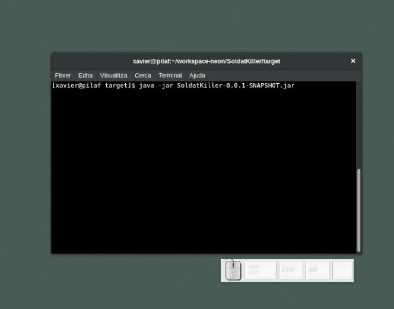

#FpExperiencies #DawMp03Uf05 #Programació

Caçador d'enemics
=====================

Objectius: Veure com funciona la serialització a disc d’objectes 

Serialització d’objectes
-------------------------
Els objectes de Java poden ser convertits a seqüències de bits de manera que podran ser emmagatzemats i recuperats de disc de la mateixa forma que qualsevol altra dada binària fent servir ObjectInputStream i ObjectOutputStream

Per poder ser serialitzats només cal que la seva classe implementi la interfície Serializable:

    class anec implements Serializable {
        String color;
        String crit;		
        String crida() {
            System.out.println(crit);
        }			
    }

Activitat
--------------
Se us demana que feu un programa amb la llibreria ACM que vagi fent que apareguin cada cert temps, soldats amics o enemics per pantalla.

* Els grocs són enemics que s'han d'eliminar fent-hi clic a sobre amb el ratolí
* Els vermells són amics i no s'han de tocar o el programa acabarà

A més el programa ha de portar el compte dels enemics que s'han matat i dels que s'han escapat.

El programa pot acabar al prémer una de les dues tecles següents: 

* **prement la tecla “S”**:  Si es torna a arrancar el programa ha de continuar des d’on estava quan es va aturar.
* **prement la tecla “X”**: Si es torna a iniciar el programa ha de començar de nou.

O bé quan s'hagin escapat "massa" enemics
